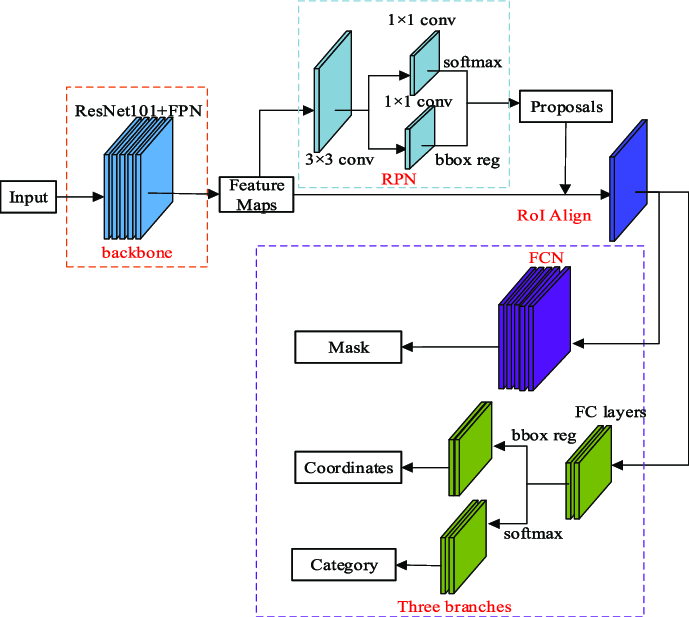

# Mask R-CNN for SPACECRAFT 
I get my insights from the creator of Resnet: Kaiming He el's thesis:\
`(Based on the [MASK R-CNN thesis](https://arxiv.org/pdf/1703.06870.pdf))`

### target
Predict bounding box, type of the spacecraft and the possibality. `Mask R-CNN` is definitely what I need

## dataset
based on the metadata\
we have 30 types Satellite and 288 Background\
also we have train label\
we need to combine these together!\
and in all, we have 25802 number of picture!\
each with the size (1280, 1024, 3)

## visulization from metadata.ipynb
`not bad` but how can I add the percentage my model predict that is a satellite?
I need to add more element to my model now
- add segmentation (using the data from no_background)
- add callbacks
- add probability

## utils.py
all the self-defined functions are in the [utils.py](https://github.com/y1u2a3n4g5/Mask-R-CNN/blob/main/utils.py), there are also many detailed description inside.

## model visulization

## Modelling Steps

### **Step 1:** Backbone and FPN
Backbone: Use TensorFlow's Keras API to load a pre-trained ResNet without the top layer.

`function` 
- [ ] build_resnet_backbone()
- [ ] build_fpn
- [ ] resnet_fpn

FPN: Implement or use an existing FPN layer that takes feature maps from the backbone and produces a pyramid of feature maps.
****
### **Step 2:** *RPN

Implementing the Region Proposal Network (RPN) for a Feature Pyramid Network (FPN) setup involves two main tasks: 

1. anchor generation 

Anchor boxes are predefined boxes of various scales and aspect ratios that serve as references at different positions across the image. They are crucial for detecting objects of different shapes and sizes.

2. building the RPN head that processes the feature pyramid levels. 

Anchor Generation: Define anchor boxes at different scales and aspect ratios.

RPN Head: Apply a small convolutional network to the feature pyramid levels to generate objectness scores and bounding box deltas for each anchor.

`function`
- [ ] load_and_process_image
- [ ] generate_anchors
- [ ] crop_regions_from_feature_map
Comprehensive Object Detection: By concatenating RPN predictions across all FPN levels, the model integrates multi-scale information, enhancing its ability to detect objects across a wide range of sizes. This is particularly important in complex images where objects vary significantly in scale.
****
### **Step 3:** RoI Align
Proposal Selection: Use the RPN outputs to select high-scoring proposals. Apply non-maximum suppression (NMS) to reduce overlaps.

RoI Align: For each proposal, extract a fixed-size feature map from the FPN layers using bilinear interpolation.

- [ ] roi_align

****
### **Step 4**: dataset for training\
tf.data.Dataset generating
- [ ] process_batch
- [ ] fpn_dataflow
- [ ] create_bbox_model
- [ ] load_and_process_image_bbox
- [ ] process_batch_bbox
- [ ] bbox_dataflow
- [ ] bbox_fpn_datasets

### **Step 5**: model creation:
- Classification and Regression: Apply fully connected layers on RoI-aligned features to classify objects and refine bounding box locations.

- Mask Prediction: Use a convolutional network on RoI-aligned features to predict segmentation masks.

#### Classification
- [ ] create_classification_model
- [ ] one_hot_encode_labels
- [ ] classification_dataflow
- [ ] class_fpn_datasets

#### Bounding Box
- [ ] create_bbox_model
- [ ] load_and_process_image_bbox
- [ ] process_batch_bbox
- [ ] bbox_dataflow
- [ ] bbox_fpn_datasets

#### Mask
- [ ] conv_block
- [ ] encoder_block
- [ ] decoder_block
- [ ] create_mask_fpn_model
- [ ] load_and_process_mask
- [ ] mask_dataflow
- [ ] mask_fpn_dataflow

